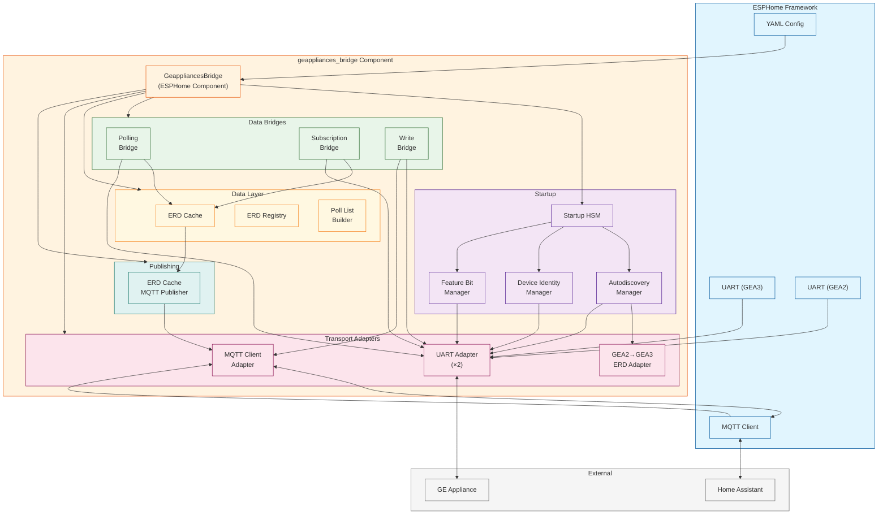
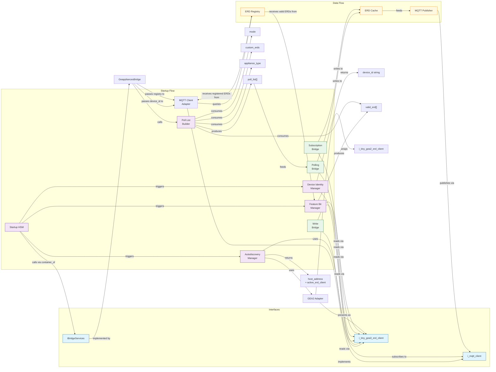
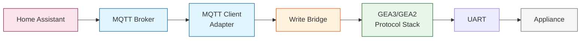

# Architecture

High-level architecture of the GE Appliances Bridge ESPHome component.

## Overview

The component bridges GE appliances (via GEA2/GEA3 serial protocols) to Home Assistant (via MQTT). It runs on an ESP32 microcontroller as an ESPHome custom component. The component owns the full lifecycle: discovering the appliance on the serial bus, reading its identity, determining which ERDs (Entity-Relationship Data points) are available, and then continuously publishing those values to MQTT while accepting write commands from Home Assistant.

## Module Descriptions

### GeappliancesBridge (`geappliances_bridge.h` / `geappliances_bridge.cpp`)

The ESPHome component entry point. Owns all component instances, wires them together during `setup()`, and drives the main loop. Implements `IBridgeServices` so the startup HSM can request bridge actions without a compile-time dependency on the concrete class.

**Responsibilities:**
- Construct and own all managers, bridges, adapters, and data structures
- Wire components together during `setup()` based on YAML configuration
- Drive the GEA2 tight-loop and delegate ongoing work in `loop()`
- Expose configuration setters called by the ESPHome code generator (`__init__.py`)
- Implement `IBridgeServices` for the startup HSM

**Dependencies:** All other modules in this component.

---

### Startup HSM (`geappliances_bridge_startup_hsm.h` / `geappliances_bridge_startup_hsm.cpp`)

A `tiny_hsm` state machine that drives the ordered startup phase sequence. Each phase runs to completion before the next begins. Uses `container_of` to recover the `IBridgeServices` pointer from the HSM context.

**Phase sequence:**
1. **protocol_stack** — Initialize UART adapters and GEA3/GEA2 interfaces
2. **startup_delay** — Wait 5 seconds for the appliance to stabilize
3. **autodiscovery** — Broadcast to find the appliance host address and protocol
4. **device_id** — Read identity ERDs and assemble the device ID string
5. **mqtt_client_init** — Initialize the MQTT client adapter with the device ID
6. **feature_bits** — Read and parse appliance API feature bit ERDs
7. **bridge_init** — Initialize the polling and/or subscription bridge(s)
8. **subscription_watch** — Wait for subscription bridge to reach steady state (if applicable)
9. **running** — Steady-state operation; dispatch recurring work

**Dependencies:** `IBridgeServices`, `tiny_hsm`

---

### Autodiscovery Manager (`autodiscovery_manager.h` / `autodiscovery_manager.cpp`)

Self-driving broadcast discovery on the GEA bus. Sends broadcast reads to address `0xFF` to find the appliance. Supports GEA3 and GEA2 protocols with fallback: if GEA3 gets no response, it tries GEA2 (if both UARTs are configured). Retries indefinitely.

**Responsibilities:**
- Manage the GEA3→GEA2 fallback broadcast discovery sequence
- Own timer-based state machine (no polling from bridge)
- Subscribe to ERD client activity events directly
- Expose the discovered host address and active ERD client via getters

**Dependencies:** `i_tiny_gea3_erd_client`, `i_tiny_gea2_erd_client`, `tiny_timer`, `tiny_event`

---

### Device Identity Manager (`device_identity_manager.h` / `device_identity_manager.cpp`)

Reads appliance identity ERDs and assembles a stable, MQTT-topic-safe device identifier string. Self-driving: queues reads internally via callbacks, retrying indefinitely on failure.

**Responsibilities:**
- Read ERDs `0x0008` (appliance type), `0x0001` (model number), `0x0002` (serial number) in sequence
- Sanitize raw values into MQTT-safe strings
- Concatenate into a final device ID
- Always reads ERDs even when a `device_id` is pre-configured in YAML

**Dependencies:** `i_tiny_gea3_erd_client`

---

### Feature Bit Manager (`feature_bit_manager.h` / `feature_bit_manager.cpp`)

Reads and parses appliance API feature bit ERDs (`0x0092`–`0x010D`), producing a filtered set of ERDs that are available on this specific appliance. Fully self-driving: owns its own timers and event subscriptions.

**Responsibilities:**
- Read 11 feature bit ERDs in sequence
- Incrementally parse bitmasks into ERD sets across multiple timer ticks (avoids ESP32 Task Watchdog Timer)
- Expose the resulting valid ERD set via getters

**Dependencies:** `i_tiny_gea3_erd_client`, `tiny_event`, `tiny_timer`, `appliance_api_feature_lists.h`

---

### ERD Cache (`erd_cache.h` / `erd_cache.cpp`)

Fixed-size cache (200 entries) for ERD values. ERDs ≤ 4 bytes are stored inline (zero heap); larger ERDs use heap allocation. ERD size is invariant after registration — updates are in-place `memcpy` with no alloc or free. Change detection at insert/update time eliminates per-read `memcmp` overhead.

**Responsibilities:**
- Store latest data for up to 200 ERDs
- Detect changes at update time, marking `update_required`
- Support configurable publish rate limiting via `publish_cooldown` per entry

**Dependencies:** `tiny_gea3_erd_client` (for `tiny_erd_t` type)

---

### ERD Registry (`erd_registry.h` / `erd_registry.cpp`)

Single authoritative source for which ERDs are valid (from feature bits) and which are registered at runtime (from the MQTT adapter). Provides the valid-ERD filter used during publishing.

**Responsibilities:**
- Own the valid-ERD set (populated by FeatureBitManager at startup)
- Own the registered-ERD set (appended by the MQTT adapter at runtime)
- Expose `is_valid()` query used by the MQTT adapter during publish

**Dependencies:** `tiny_erd.h`

---

### Poll List Builder (`erd_poll_list_builder.h` / `erd_poll_list_builder.cpp`)

Pure function — no HSM, no timers, no I/O. Given the current operating mode, subscription state, feature-bit results, custom ERDs, and appliance type, returns a deduplicated list of ERDs that the polling bridge should probe.

**Decision logic:**
- **SUBSCRIBE mode** (subscription confirmed) → custom ERDs only
- **POLL mode**, `appliance_api_parsing=true` → feature bit valid ERDs + custom ERDs
- **POLL mode**, `appliance_api_parsing=false` → common ERDs + energy ERDs + appliance API feature ERDs + appliance-specific ERDs + custom ERDs
- **AUTO mode**, subscription active → custom ERDs only
- **AUTO mode**, subscription not active → same as POLL mode

**Dependencies:** `bridge_mode.h`, `tiny_erd.h`, `erd_lists.h`

---

### Polling Bridge (`erd_bridge_poll.h` / `erd_bridge_poll.cpp`)

Periodically polls a list of ERDs from the appliance and updates their values in the ERD cache. Drives a `tiny_hsm` for probe discovery, polling, and appliance-lost recovery.

**Three-phase lifecycle:**
1. **Build Verification List** — Determines which ERDs to probe (no reads)
2. **Verification** — Sequential reads to verify each ERD responds; builds the polling list
3. **Steady-State Polling** — All registered ERDs are read sequentially each cycle

**Dependencies:** `i_tiny_gea3_erd_client`, `tiny_hsm`, `tiny_timer`, `erd_lists.h`, `erd_bridge_common.h`

---

### Subscription Bridge (`erd_bridge_subscribe.h` / `erd_bridge_subscribe.cpp`)

Subscribes to all ERDs at the appliance's address and relays their published values to the ERD cache. Manages a `tiny_hsm` that drives the GEA3 subscription lifecycle. Retains subscription every 30 seconds.

**Dependencies:** `i_tiny_gea3_erd_client`, `tiny_hsm`, `tiny_timer`, `erd_bridge_common.h`

---

### Write Bridge (`erd_write_bridge.h` / `erd_write_bridge.cpp`)

Thin relay between MQTT write requests and the GEA3 ERD client. Subscribes to `mqtt_client_on_write_request`, forwards writes to the ERD client, and reports results back to MQTT. Two-state HSM (ready/writing) prevents concurrent writes.

**Dependencies:** `i_tiny_gea3_erd_client`, `i_mqtt_client`, `tiny_hsm`, `tiny_event`

---

### ERD Cache MQTT Publisher (`erd_cache_mqtt_publisher.h` / `erd_cache_mqtt_publisher.cpp`)

Drains updated ERD cache entries to MQTT topics with `retain=true`. On ESP-IDF, runs in a FreeRTOS background task to avoid blocking the ESPHome main loop on the IDF MQTT mutex. On non-ESP-IDF, runs in the main loop with budget parameters.

**Responsibilities:**
- Iterate cache entries with `update_required=true`
- Publish to `geappliances/{deviceId}/erd/0x{ERD:04X}/value`
- Pause on MQTT disconnect, resume on reconnect
- Track publish rate statistics

**Dependencies:** `erd_cache`, `i_mqtt_client`, `tiny_event`

---

### ESPHome MQTT Client Adapter (`esphome_mqtt_client_adapter.h` / `esphome_mqtt_client_adapter.cpp`)

Implements the `i_mqtt_client_t` interface for the bridge, publishing ERD value updates to MQTT topics via ESPHome's global MQTT client. Handles wildcard write topic subscription, hex payload formatting, and connect/disconnect event propagation.

**Dependencies:** `i_mqtt_client`, `ErdRegistry`, ESPHome `mqtt::global_mqtt_client`

---

### ESPHome UART Adapter (`esphome_uart_adapter.h` / `esphome_uart_adapter.cpp`)

Adapts ESPHome's `UARTComponent` to the `i_tiny_uart_t` interface expected by the GEA protocol stack. Polls the ESPHome UART each `loop()` tick and emits receive events. Supports enable/disable for dual-UART configurations.

**Dependencies:** ESPHome `uart::UARTComponent`, `i_tiny_uart`, `tiny_event`, `tiny_timer`

---

### GEA2→GEA3 ERD Client Adapter (`gea2_erd_client_adapter.h` / `gea2_erd_client_adapter.cpp`)

Wraps a GEA2 ERD client (`i_tiny_gea2_erd_client_t`) and presents it as a GEA3 ERD client (`i_tiny_gea3_erd_client_t`). Forwards `read()` and `write()` to the underlying GEA2 client. `subscribe()` and `retain_subscription()` are no-ops (GEA2 has no subscription support). Re-publishes GEA2 activity events through the GEA3-typed `on_activity` event.

**Dependencies:** `i_tiny_gea2_erd_client`, `i_tiny_gea3_erd_client`, `tiny_event`

---

### ESPHome Time Source (`esphome_time_source.h` / `esphome_time_source.cpp`)

Provides ESPHome's `millis()`-based monotonic clock as an `i_tiny_time_source_t` for use by the tiny library.

**Dependencies:** `i_tiny_time_source`

---

### Bridge Mode (`bridge_mode.h`)

Defines the `BridgeMode` enumeration: `POLL` (0), `SUBSCRIBE` (1), `AUTO` (2). Standalone header to avoid circular dependencies between `IBridgeServices` and `GeappliancesBridge`.

---

### IBridgeServices (`i_bridge_services.h`)

Abstract interface between the startup HSM and the bridge. Declares every operation the HSM is allowed to invoke on the bridge (phase transitions, completion queries, recurring work dispatch). The `GeappliancesBridge` class implements this interface.

**Dependencies:** `bridge_mode.h`, `erd_bridge_common.h`

---

### ERD Bridge Common (`erd_bridge_common.h`)

Shared timing constants, HSM signal identifiers, and utility templates used by both `erd_bridge_subscribe` and `erd_bridge_poll`. Defines `erd_set_t` (fixed-capacity sorted ERD set), `arm_timer`/`disarm_timer` templates, and state enums.

**Dependencies:** `tiny_erd`, `tiny_hsm`, `tiny_timer`, `tiny_utils`, `tiny_gea_constants`

---

### Constants (`geappliances_bridge_constants.h`)

Shared ERD constants and inline helpers: well-known ERD identifiers (model number, serial number, appliance type, feature bit ERDs), GEA bus broadcast address, and helper functions (`is_feature_bit_erd`, `read_be64`).

---

### ERD Lists (`erd_lists.h`)

Compile-time ERD lists organized by appliance category: common, refrigeration, laundry, dishwasher, water heater, range, air conditioning, water filter, small appliance, and energy. Also maps appliance type bytes to their corresponding ERD list.

---

### Appliance API Feature Lists (`appliance_api_feature_lists.h`)

Generated bitmask descriptors for parsing feature bit ERDs. Maps individual bits in each feature ERD to the actual ERDs they represent.

---

### Python Entry Point (`__init__.py`)

ESPHome component registration. Defines the YAML configuration schema, validates configuration, and generates C++ code via `to_code()`. Loads appliance type mappings from the API documentation library and generates the `appliance_type_to_string()` C++ function.

**Dependencies:** ESPHome core, `cg` (code generator), `cv` (configuration validation)

---

## Module Connections

### Connection Summary

| Module | Depends On | Used By |
|---|---|---|
| `GeappliancesBridge` | All modules | ESPHome framework |
| `Startup HSM` | `IBridgeServices`, `tiny_hsm` | `GeappliancesBridge` |
| `Autodiscovery Manager` | `i_tiny_gea3_erd_client`, `i_tiny_gea2_erd_client`, `tiny_timer`, `tiny_event` | `GeappliancesBridge`, `Startup HSM` |
| `Device Identity Manager` | `i_tiny_gea3_erd_client` | `GeappliancesBridge`, `Startup HSM` |
| `Feature Bit Manager` | `i_tiny_gea3_erd_client`, `tiny_timer`, `tiny_event`, `appliance_api_feature_lists.h` | `GeappliancesBridge`, `Startup HSM`, `ErdRegistry`, `Poll List Builder` |
| `ERD Cache` | `tiny_erd` | `Polling Bridge`, `Subscription Bridge`, `MQTT Publisher` |
| `ERD Registry` | `tiny_erd` | `Feature Bit Manager` (writes), `MQTT Adapter` (reads) |
| `Poll List Builder` | `bridge_mode.h`, `tiny_erd`, `erd_lists.h` | `GeappliancesBridge` |
| `Polling Bridge` | `i_tiny_gea3_erd_client`, `tiny_hsm`, `tiny_timer`, `erd_bridge_common.h` | `GeappliancesBridge`, `Startup HSM` |
| `Subscription Bridge` | `i_tiny_gea3_erd_client`, `tiny_hsm`, `tiny_timer`, `erd_bridge_common.h` | `GeappliancesBridge`, `Startup HSM` |
| `Write Bridge` | `i_tiny_gea3_erd_client`, `i_mqtt_client`, `tiny_hsm`, `tiny_event` | `GeappliancesBridge` |
| `MQTT Publisher` | `erd_cache`, `i_mqtt_client`, `tiny_event` | `GeappliancesBridge` |
| `MQTT Client Adapter` | `i_mqtt_client`, `ErdRegistry`, ESPHome MQTT | `MQTT Publisher`, `Write Bridge` |
| `UART Adapter` | ESPHome UART, `i_tiny_uart`, `tiny_event`, `tiny_timer` | GEA3/GEA2 protocol stack (submodule) |
| `GEA2 Adapter` | `i_tiny_gea2_erd_client`, `i_tiny_gea3_erd_client`, `tiny_event` | `Autodiscovery Manager`, `Polling Bridge` (via `get_active_erd_client`) |
| `Time Source` | `i_tiny_time_source` | GEA3/GEA2 protocol stack (submodule) |
| `IBridgeServices` | `bridge_mode.h`, `erd_bridge_common.h` | `Startup HSM` |
| `Bridge Mode` | (none) | `IBridgeServices`, `GeappliancesBridge`, `Poll List Builder` |
| `ERD Bridge Common` | `tiny_erd`, `tiny_hsm`, `tiny_timer`, `tiny_utils`, `tiny_gea_constants` | `Polling Bridge`, `Subscription Bridge` |
| `Constants` | `tiny_gea3_erd_client` | All bridge modules |
| `ERD Lists` | `tiny_erd` | `Poll List Builder` |
| `Feature Lists` | (generated) | `Feature Bit Manager` |

## Data Flow

### Read Path (Appliance → Home Assistant)

```mermaid
graph LR
    APPLIANCE["Appliance"] --> UART["UART"]
    UART --> PROTOCOL["GEA3/GEA2<br/>Protocol Stack"]
    PROTOCOL --> BRIDGES["Polling /<br/>Subscription Bridge"]
    BRIDGES --> CACHE["ERD Cache"]
    CACHE --> PUB["MQTT Publisher"]
    PUB --> MQTT["MQTT Client<br/>Adapter"]
    MQTT --> BROKER["MQTT Broker"]
    BROKER --> HA["Home Assistant"]

    classDef appliance fill:#f5f5f5,stroke:#616161
    classDef protocol fill:#e8f5e9,stroke:#1b5e20
    classDef bridge fill:#fff3e0,stroke:#e65100
    classDef cache fill:#f3e5f5,stroke:#4a148c
    classDef mqtt fill:#e1f5fe,stroke:#01579b
    classDef ha fill:#fce4ec,stroke:#880e4f

    class APPLIANCE appliance
    class PROTOCOL protocol
    class BRIDGES bridge
    class CACHE cache
    class MQTT,PUB,BROKER mqtt
    class HA ha
```

1. **Protocol Stack** (submodule) receives ERD data from the appliance via UART
2. **Polling/Subscription Bridge** processes the data and writes to the **ERD Cache**
3. **ERD Cache** detects changes and marks entries as `update_required`
4. **MQTT Publisher** drains updated entries and publishes hex values to MQTT topics
5. **Home Assistant** receives the MQTT messages via the ESPHome integration

### Write Path (Home Assistant → Appliance)

1. **Home Assistant** publishes a write command to `geappliances/{device_id}/erd/0x{ERD}/write`
2. **MQTT Adapter** receives the command via wildcard subscription and fires `on_write_request` event
3. **Write Bridge** forwards the write to the **ERD Client** and reports the result back to MQTT

## Submodule Boundary

The `lib/tiny` and `lib/tiny-gea-api` submodules provide the GEA protocol stack (UART HAL, GEA3/GEA2 interfaces, ERD clients, HSM, timer, event system). The bridge component interacts with them through well-defined C interfaces (`i_tiny_uart_t`, `i_tiny_gea3_erd_client_t`, `i_tiny_gea2_erd_client_t`, `i_tiny_time_source_t`, `i_mqtt_client_t`). The architecture document above covers only the modules within this repository; the submodule internals are abstracted behind these interfaces.
