# Data Flow

This document describes the three primary data paths through the bridge: reading
appliance state to Home Assistant, writing commands from Home Assistant to the
and publishing Home Assistant MQTT discovery entities on discovery data changes or Discovery Refresh.

## Read Path (Appliance → Home Assistant)

The read path carries sensor values, status flags, and other appliance data from
the serial bus into Home Assistant as live state.

```mermaid
%%{init: {"theme":"neutral","themeVariables":{"primaryColor":"#4a90d9","primaryBorderColor":"#2c6a9e","primaryTextColor":"#1a1a1a","secondaryColor":"#d9e8f5","tertiaryColor":"#f0f0f0","lineColor":"#999999","clusterBkg":"#f5f5f5","clusterBorder":"#aaaaaa","fontFamily":"monospace","nodeBorder":"#888888","edgeLabelBackground":"#ffffff"}}}%%
graph LR
    APPLIANCE["Appliance"] --> UART["UART Adapter<br/>(esphome_uart_adapter)"]
    UART --> PROTOCOL["GEA3/GEA2<br/>Protocol Stack"]
    PROTOCOL --> BRIDGES["Polling Bridge /<br/>Subscription Bridge"]
    BRIDGES --> CACHE["ERD Cache"]
    CACHE --> PUB["MQTT Publisher<br/>(erd_cache_mqtt_publisher)"]
    PUB --> MQTT["MQTT Client<br/>Adapter"]
    MQTT --> BROKER["MQTT Broker"]
    BROKER --> HA["Home Assistant"]

    classDef appliance fill:#e8e8e8,stroke:#999999
    classDef protocol fill:#e8f5e9,stroke:#2e7d32
    classDef bridge fill:#d9e8f5,stroke:#2c6a9e
    classDef cache fill:#f3e5f5,stroke:#7b1fa2
    classDef mqtt fill:#e8e8f0,stroke:#5c6bc0
    classDef ha fill:#fce4ec,stroke:#880e4f

    class APPLIANCE appliance
    class PROTOCOL protocol
    class BRIDGES bridge
    class CACHE cache
    class MQTT,PUB,BROKER mqtt
    class HA ha
```



1. **Protocol Stack** (submodule) receives ERD data from the appliance via UART,
   delivered through the UART Adapter (`esphome_uart_adapter`).
2. **Polling Bridge** (`erd_bridge_poll`) periodically reads a verified list of
   ERDs. **Subscription Bridge** (`erd_bridge_subscribe`) receives real-time
   updates for subscribed ERDs. Both write results to the ERD Cache.
3. **ERD Cache** (`erd_cache`) stores the latest value for each ERD and marks
   entries as `update_required` when a value changes.
4. **MQTT Publisher** (`erd_cache_mqtt_publisher`) iterates the cache with a
   round-robin index, publishes hex values to
   `geappliances/{deviceId}/erd/0x{ERD:04X}/value` with `retain=true`, and
   pauses on MQTT disconnect.
5. **Home Assistant** receives the MQTT messages via the ESPHome integration.

## Write Path (Home Assistant → Appliance)

The write path carries user commands from Home Assistant back to the appliance
over the serial bus.

```mermaid
%%{init: {"theme":"neutral","themeVariables":{"primaryColor":"#4a90d9","primaryBorderColor":"#2c6a9e","primaryTextColor":"#1a1a1a","secondaryColor":"#d9e8f5","tertiaryColor":"#f0f0f0","lineColor":"#999999","clusterBkg":"#f5f5f5","clusterBorder":"#aaaaaa","fontFamily":"monospace","nodeBorder":"#888888","edgeLabelBackground":"#ffffff"}}}%%
graph LR
    HA["Home Assistant"] --> BROKER["MQTT Broker"]
    BROKER --> MQTT["MQTT Client<br/>Adapter"]
    MQTT --> WRITE["Write Bridge<br/>(erd_write_bridge)"]
    WRITE --> PROTOCOL["GEA3/GEA2<br/>Protocol Stack"]
    PROTOCOL --> UART["UART Adapter<br/>(esphome_uart_adapter)"]
    UART --> APPLIANCE["Appliance"]

    classDef appliance fill:#e8e8e8,stroke:#999999
    classDef protocol fill:#e8f5e9,stroke:#2e7d32
    classDef bridge fill:#d9e8f5,stroke:#2c6a9e
    classDef mqtt fill:#e8e8f0,stroke:#5c6bc0
    classDef ha fill:#fce4ec,stroke:#880e4f

    class APPLIANCE appliance
    class PROTOCOL protocol
    class WRITE bridge
    class MQTT,BROKER mqtt
    class HA ha
```



1. **Home Assistant** publishes a write command to
   `geappliances/{device_id}/erd/0x{ERD}/write`.
2. **MQTT Adapter** receives the command via wildcard subscription and fires the
   `on_write_request` event.
3. **Write Bridge** (`erd_write_bridge`) forwards the write to the ERD Client
   via `tiny_gea3_erd_client_write`, gates writes on appliance identification
   (host address must not be broadcast `0xFF`), and reports the result back to
   MQTT via `mqtt_client_update_erd_write_result`.
4. The **Protocol Stack** packages the write into a GEA3/GEA2 message and
   transmits it over UART to the appliance.


## Discovery Path (Discovery Changes / Discovery Refresh → Home Assistant)

Home Assistant MQTT discovery topics are retained on the MQTT broker, so normal
boots skip discovery entirely. Discovery runs in four scenarios:

1. **Discovery Refresh button:** When pressed, the button queues a cleanup +
   republish + reboot cycle. If pressed before the bridge is ready (steady state,
   MQTT connected, device ID complete), the request is queued and executes once
   the bridge is ready.
2. **Discovery data hash change:** After a firmware update that changes discovery
   definitions, the bridge detects the hash mismatch at steady state, cleans old
   discovery topics, publishes fresh ones, and reboots to defragment the heap.
3. **Device ID change:** If the device ID changes (e.g. appliance swap or
   configuration change), the bridge detects the mismatch at steady state, cleans
   old discovery topics, publishes fresh ones, and reboots.
4. **Fresh install:** On first boot with no stored discovery state, the bridge
   publishes discovery topics only (no cleanup or reboot).

### Discovery Change Detection

At steady state, the bridge compares the current `HA_DISCOVERY_DATA_HASH` (computed
by the build-time pipeline) and the current device ID against the stored
`DiscoveryNVS {hash, device_id}` struct in NVS. If either differs, it triggers
cleanup → publish → reboot. The stored state is updated after each successful
publish so subsequent boots detect no change.

```
Firmware update → steady state → detect discovery hash/device_id change
  → cleanup old discovery topics
  → publish fresh discovery topics
  → mark boot successful (clear safe mode counter, cancel OTA rollback)
  → wait 5 s → safe_reboot()
```

### Discovery Refresh Flow

```
Button press → queue request via `ota_cleanup_manager_.trigger_discovery_refresh()`
  → wait for steady state, MQTT, device ID
  → cleanup old discovery topics
  → publish fresh discovery topics
  → mark boot successful
  → wait 5 s → safe_reboot()
```

### Entity Definition Pipeline

Entity definitions are embedded as compressed JSONL chunks in `ha_discovery_data.h`
and streamed through a main-loop pipeline:

```mermaid
%%{init: {"theme":"neutral","themeVariables":{"primaryColor":"#4a90d9","primaryBorderColor":"#2c6a9e","primaryTextColor":"#1a1a1a","secondaryColor":"#d9e8f5","tertiaryColor":"#f0f0f0","lineColor":"#999999","clusterBkg":"#f5f5f5","clusterBorder":"#aaaaaa","fontFamily":"monospace","nodeBorder":"#888888","edgeLabelBackground":"#ffffff"}}}%%
graph LR
    EMBEDDED["Embedded JSONL<br/>(ha_discovery_data.h)"] --> DECOMPRESS["Decompress<br/>(tinfl/miniz)"]
    DECOMPRESS --> PARSE["Parse JSONL<br/>(zero-allocation parser)"]
    PARSE --> FILTER["Filter<br/>(registered ERDs + keywords)"]
    FILTER --> PUBLISH["Publish HA Discovery<br/>Topics"]
    PUBLISH --> MQTT["MQTT Client<br/>Adapter"]
    MQTT --> BROKER["MQTT Broker"]
    BROKER --> HA["Home Assistant"]

    classDef embedded fill:#fff3e0,stroke:#e65100
    classDef decompress fill:#e8f5e9,stroke:#2e7d32
    classDef parse fill:#e8e8f0,stroke:#5c6bc0
    classDef filter fill:#fce4ec,stroke:#880e4f
    classDef mqtt fill:#e8e8f0,stroke:#5c6bc0
    classDef ha fill:#fce4ec,stroke:#880e4f

    class EMBEDDED embedded
    class DECOMPRESS decompress
    class PARSE parse
    class FILTER filter
    class MQTT,BROKER mqtt
    class HA ha
```



1. **Embedded JSONL** — Compressed chunks are stored in `ha_discovery_data.h`,
   organized by category (e.g. `common`, `range`, `washer`). Each category
   contains independently-compressible chunks to keep the decompression buffer
   small (18 KB max).
2. **Decompress** — The `tinfl` (miniz) decompressor expands one chunk at a
   time into a pre-allocated 18 KB buffer. The decompressor state is
   re-initialized per chunk so each is self-contained.
3. **Parse JSONL** — A zero-allocation JSON parser extracts fields from each
   newline-delimited JSON line. All buffers (payload, topic, entity fields) are
   pre-allocated on the struct to avoid heap allocation during processing.
4. **Filter** — Entities are filtered in two stages:
   - **Registered ERD check**: a binary search over the sorted ERD list from
     the cache skips entities whose ERD is not registered on this appliance.
   - **Keyword filter**: when `filter_config_topics` is enabled, entities with
     names matching diagnostic keywords (e.g. "linux diagnostics", "reset
     reason") are skipped.
5. **Publish HA Discovery Topics** — Each entity is published to
  `homeassistant/{domain}/{device_id}/{erd_id}_{field_id}/config` with a
   JSON payload containing the device info, state topic, command topic (for
   writable ERDs), and entity metadata.
6. **Home Assistant** receives the discovery messages and auto-registers the
   entities.

### Discovery State Machine

The discovery manager transitions through states:

```
IDLE → BUILDING → DISCOVERING → COMPLETE / FAILED
```

- **BUILDING**: constructs the sorted ERD array from the cache and builds the
  device JSON once.
- **DISCOVERING**: called from the main loop via `ha_discovery_manager_run()`;
  publishes one entity per call to keep loop times low.
- **COMPLETE**: all categories and chunks processed.
- **FAILED**: decompression or parsing error.

## Cross-References

- [Architecture Overview](./overview.md) — system context and module layout
- [Startup Sequence](./startup-sequence.md) — HSM phases that initialize each path
- [ERD Cache spec](../spec/erd_cache.md) — cache structure and update semantics
- [MQTT Publisher spec](../spec/erd_cache_mqtt_publisher.md) — publishing loop and pause/resume
- [Write Bridge spec](../spec/erd_write_bridge.md) — write relay and result reporting
- [HA Discovery Manager](../spec/ha_discovery_manager.md) — discovery pipeline specification
- [Pipeline Guide](../guides/pipeline.md) — build-time ERD definition processing