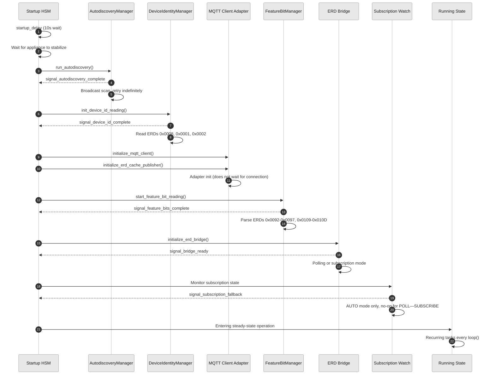

# Startup Sequence

The GE Appliances Bridge uses a `tiny_hsm`-based hierarchical state machine to
drive an ordered startup sequence from hardware initialization to steady-state
operation. Each phase runs to completion before the next begins. The HSM uses
`container_of` to recover the `IBridgeServices` pointer from its context,
delegating all phase-specific work to managers while enforcing ordering and
timeout guards.

## Sequence Diagram

## Phase-by-Phase Breakdown

### Phase 1: Startup Delay

Waits `AUTODISCOVERY_STARTUP_DELAY_MS` (10 seconds) for the appliance board
to stabilize before beginning broadcast discovery. UART and protocol
initialization occur earlier in `setup()`. The HSM polls
`is_startup_delay_elapsed()` on each `signal_run_loop` iteration.

| Detail | Value |
|---|---|
| **Source** | `geappliances_bridge_startup_hsm.cpp` `startup_state_startup_delay` |
| **Duration** | ~10 seconds (`AUTODISCOVERY_STARTUP_DELAY_MS`) |
| **Failure behavior** | None (unconditional delay) |
| **Transition** | `autodiscovery` |

### Phase 2: Autodiscovery

Runs the `AutodiscoveryManager` to broadcast-scan the GEA bus for an
appliance. The manager is self-driving with its own timers and event
subscriptions. If no board responds, the manager retries indefinitely —
this state will not transition until a valid board address is found.

| Detail | Value |
|---|---|
| **Source** | `geappliances_bridge_startup_hsm.cpp` `startup_state_autodiscovery` |
| **Duration** | Variable (retries indefinitely until a board responds) |
| **Failure behavior** | Retries indefinitely; never gives up |
| **Signals** | `signal_autodiscovery_complete` |
| **Transition** | `device_id` |

### Phase 3: Device Identity

Runs the `DeviceIdentityManager` to read three identity ERDs in sequence:
`0x0008` (appliance type), `0x0001` (model number), `0x0002` (serial number).
Raw values are sanitized into MQTT-safe strings and concatenated into the
device ID. The manager always reads all three identity ERDs in sequence,
even when a device_id is pre-configured in YAML (the preconfigured value
is used as a fallback by get_device_id() but does not skip the reads). On
read failure, the manager retries indefinitely.

| Detail | Value |
|---|---|
| **Source** | `geappliances_bridge_startup_hsm.cpp` `startup_state_device_id` |
| **Duration** | Variable (typically seconds; retries indefinitely on failure) |
| **Failure behavior** | Retries indefinitely; never gives up |
| **Signals** | `signal_device_id_complete` |
| **Transition** | `mqtt_client_init` |

### Phase 4: MQTT Client Init

Initializes the MQTT client adapter and the ERD cache MQTT publisher with the
device ID. This phase is fast — it does not wait for the MQTT broker
connection. It also kicks off feature-bit reading before transitioning.

| Detail | Value |
|---|---|
| **Source** | `geappliances_bridge_startup_hsm.cpp` `startup_state_mqtt_client_init` |
| **Duration** | <1 ms (init only; no connection wait) |
| **Failure behavior** | Idempotent init; no failure path |
| **Transition** | `feature_bits` |

### Phase 5: Feature Bits

Runs the `FeatureBitManager` to read and parse 11 appliance API feature bit
ERDs: `0x0092` (common features) and `0x0093`–`0x0097`, `0x0109`–`0x010D`
(appliance-specific API groups). Each ERD is 8 bytes: `[2B type][2B version]
[4B bitmap]`. The manager is self-driving with its own timers. If the ERD
client queue is full, it schedules a retry timer (`QUEUE_RETRY_MS = 50 ms`).

| Detail | Value |
|---|---|
| **Source** | `geappliances_bridge_startup_hsm.cpp` `startup_state_feature_bits` |
| **Duration** | Variable (depends on queue availability and appliance response) |
| **Failure behavior** | Queue-full retries at 50 ms intervals; otherwise retries indefinitely |
| **Signals** | `signal_feature_bits_complete` |
| **Transition** | `bridge_init` |

### Phase 6: Bridge Init

Initializes the ERD bridge in the configured mode (`BRIDGE_MODE_POLL`,
`BRIDGE_MODE_SUBSCRIBE`, or `BRIDGE_MODE_AUTO`). Waits for both
`is_autodiscovery_complete()` and `is_bridge_initialized()` before calling
`initialize_erd_bridge()`. The HSM does not transition until
`signal_bridge_ready` is emitted by the polling bridge once ERD discovery is
complete.

| Detail | Value |
|---|---|
| **Source** | `geappliances_bridge_startup_hsm.cpp` `startup_state_bridge_init` |
| **Duration** | Variable (depends on ERD discovery within the bridge) |
| **Failure behavior** | Waits for `signal_bridge_ready`; no explicit timeout |
| **Signals** | `signal_bridge_ready` |
| **Transition** | `subscription_watch` |

### Phase 7: Subscription Watch

In `BRIDGE_MODE_AUTO`, monitors the subscription bridge's internal state
machine for steady-state readiness. Falls back to polling if no subscription
activity is detected or if the subscription bridge enters the failed state.
In `BRIDGE_MODE_POLL` or `BRIDGE_MODE_SUBSCRIBE`, this phase is a no-op and
transitions immediately.

| Detail | Value |
|---|---|
| **Source** | `geappliances_bridge_startup_hsm.cpp` `startup_state_subscription_watch` |
| **Duration** | Variable (AUTO mode); immediate (POLL/SUBSCRIBE modes) |
| **Failure behavior** | On subscription failure, falls back to polling mode |
| **Signals** | `signal_subscription_fallback` |
| **Transition** | `running` |

### Phase 8: Running

The terminal state of the startup sequence. All recurring tasks run every
`loop()` iteration: subscription/polling failure handling, poll state
transition logging, custom ERD polling, and steady-state detection. The
steady-state check fires once on first detection and logs the transition.

| Detail | Value |
|---|---|
| **Source** | `geappliances_bridge_startup_hsm.cpp` `startup_state_running` |
| **Duration** | Indefinite (steady-state operation) |
| **Failure behavior** | Handles subscription and polling failures gracefully at runtime |
| **Transition** | None (terminal state) |

## HSM Structure

The state hierarchy is flat — all states have `startup_state_top` as their
parent. Unhandled signals bubble up to the top state, which consumes them.

```mermaid
%%{init: {"theme":"neutral","themeVariables":{"primaryColor":"#4a90d9","primaryBorderColor":"#2c6a9e","primaryTextColor":"#1a1a1a","secondaryColor":"#d9e8f5","tertiaryColor":"#f0f0f0","lineColor":"#999999","clusterBkg":"#f5f5f5","clusterBorder":"#aaaaaa","fontFamily":"monospace","nodeBorder":"#888888"}}}%%
graph TB
    TOP["startup_state_top<br/>(root)"]
    SD["startup_state_startup_delay"]
    AD["startup_state_autodiscovery"]
    DI["startup_state_device_id"]
    MC["startup_state_mqtt_client_init"]
    FB["startup_state_feature_bits"]
    BI["startup_state_bridge_init"]
    SW["startup_state_subscription_watch"]
    RN["startup_state_running"]

    classDef root fill:#d9e8f5,stroke:#2c6a9e,stroke-width:2px
    classDef state fill:#e8e8e8,stroke:#999999
    classDef terminal fill:#e8f5e9,stroke:#2e7d32,stroke-width:2px

    class TOP root
    class SD,AD,DI,MC,FB,BI,SW state
    class RN terminal

    TOP --> SD
    TOP --> AD
    TOP --> DI
    TOP --> MC
    TOP --> FB
    TOP --> BI
    TOP --> SW
    TOP --> RN
```

## Signals

| Signal | Source | Consumed By |
|---|---|---|
| `signal_run_loop` | HSM `loop()` dispatch | All states (drives ongoing work) |
| `signal_autodiscovery_complete` | `AutodiscoveryManager` callback | `startup_state_autodiscovery` |
| `signal_device_id_complete` | `DeviceIdentityManager` callback | `startup_state_device_id` |
| `signal_feature_bits_complete` | `FeatureBitManager` callback | `startup_state_feature_bits` |
| `signal_bridge_ready` | ERD polling bridge | `startup_state_bridge_init` |
| `signal_subscription_fallback` | Subscription watchdog | `startup_state_subscription_watch` |

## Dependencies

- `IBridgeServices` — interface contract between the HSM and the bridge
- `tiny_hsm` — embedded hierarchical state machine library
- `AutodiscoveryManager` — self-driving broadcast discovery
- `DeviceIdentityManager` — ERD-based identity reading
- `FeatureBitManager` — self-driving feature bit parsing
- `EspHomeMqttClientAdapter` — MQTT client abstraction
- `ERD Bridge` (poll/subscribe) — steady-state data path

## See Also

- [Architecture Overview](./overview.md) — system context and container diagrams
- [Data Flow](./data-flow.md) — read path, write path, discovery flow
- [IBridgeServices](../../components/geappliances_bridge/i_bridge_services.h) — HSM–bridge interface
- [Startup HSM](../../components/geappliances_bridge/geappliances_bridge_startup_hsm.h) — state machine header
- [Startup HSM Implementation](../../components/geappliances_bridge/geappliances_bridge_startup_hsm.cpp) — full source